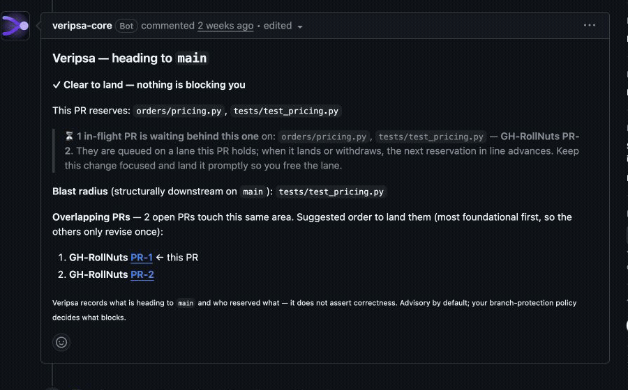

# ai-pr-collision-lab

A small, deliberately boring Python order-pricing service used by the
[Veripsa guided walkthrough](https://veripsa.com/try). It lets you see a real
Veripsa Core check on two open pull requests that need collision or landing-order
attention, without touching a repository you care about.

## Start here

| Need | Link |
| --- | --- |
| Guided walkthrough with copy buttons | <https://veripsa.com/try> |
| Collision walkthrough and real output | <https://veripsa.com/collision> |
| Install Veripsa Core | <https://veripsa.com/go/install?source=sandbox_readme> |
| Canonical fixture manifest | [`demo-manifest.json`](./demo-manifest.json) |
| Public integration contract v1.0.0 | <https://github.com/GetVeripsa/veripsa-webhook-spec/tree/v1.0.0> |
| Data handling and retention | [`DATA_HANDLING.md`](./DATA_HANDLING.md) |
| Agent usage guide | <https://veripsa.com/docs/with-agents> |

## What is in this repository

- `orders/pricing.py` — order totals; both prepared scenarios edit it.
- `orders/catalog.py` — a tiny in-memory product catalog.
- `tests/test_pricing.py` — plain pytest tests.
- `demo-manifest.json` — the machine-readable authority for the scenarios:
  their immutable source refs and commits, the branch each one materializes to,
  the shared fixture base, expected changed paths, tests, recorded-run and
  live-proof metadata, and the compatible public-contract version.
- `scripts/materialize_fixtures.py` — recreates the scenario branches in a fork
  you control, from the immutable source tags.
- `scripts/verify_fixtures.py` — verifies the immutable sources against the
  manifest from a full clone.

### The two prepared scenarios

Both scenarios are stored as **immutable annotated tags** on this repository,
not as long-lived branches. You materialize them into your own fork; no
scenario branch is ever created on this shared upstream repository.

| Materializes to | Source tag | Pretend author | Purpose |
| --- | --- | --- | --- |
| `collide-a` | `fixture-v1-agent-a` | Agent A | Add a bulk discount inside calculate_total. |
| `collide-b` | `fixture-v1-agent-b` | Agent B | Add a large-cart discount in the same pricing area. |

Each scenario is small and passes its tests independently. Both keep the
recorded fixture base
`03f70bef401b65e0c275c8b34cf9fc6d83f85379`, and each differs from it only
in `orders/pricing.py` and `tests/test_pricing.py`. CI checks those invariants
against the tags; README prose is not the fixture authority.

## Historical recorded run



The original public run was captured on **2026-07-16** at commit
[`03f70bef401b65e0c275c8b34cf9fc6d83f85379`](https://github.com/GetVeripsa/ai-pr-collision-lab/commit/03f70bef401b65e0c275c8b34cf9fc6d83f85379),
compatible with public contract **v1.0.0**:

- [PR #1](https://github.com/GetVeripsa/ai-pr-collision-lab/pull/1) held the
  earlier position while PR #2 was open.
- [PR #2](https://github.com/GetVeripsa/ai-pr-collision-lab/pull/2) updated after
  the earlier PR landed.
- A compact [MP4 version](./media/veripsa-two-prs-before-after.mp4) is included
  for social posts and presentations.
- Immutable media links: [GIF](https://github.com/GetVeripsa/ai-pr-collision-lab/raw/03f70bef401b65e0c275c8b34cf9fc6d83f85379/media/veripsa-two-prs-before-after.gif)
  and [MP4](https://github.com/GetVeripsa/ai-pr-collision-lab/raw/03f70bef401b65e0c275c8b34cf9fc6d83f85379/media/veripsa-two-prs-before-after.mp4).

This is a historical capture of the visible GitHub workflow, not a frozen copy
contract. Human sentence copy may evolve. Integrations should consume the
current machine contract instead of parsing prose from the recording. The
capture does not assert that either change is correct or safe to merge. PRs #1
and #2 are closed history; they are not live surfaces.

## Current live proof

Two pull requests are kept open on this upstream repository so a live Veripsa
Core check is always observable:
[PR #13](https://github.com/GetVeripsa/ai-pr-collision-lab/pull/13) leads and
[PR #14](https://github.com/GetVeripsa/ai-pr-collision-lab/pull/14) follows in
the same pricing area. Read their `Veripsa` checks to see the current output.
They are proof to look at, not the fixture to reproduce — reproduce the fixture
in your own fork with the walkthrough below.

## Walkthrough

### 1. Fork this repository

A `main`-only fork is fine — the scenario branches are created for you in
step 3.

- Web UI: fork from the repository page. Copying the `main` branch only is fine.
- CLI: `gh repo fork GetVeripsa/ai-pr-collision-lab --clone` forks and clones in
  one step.

### 2. Install Veripsa Core on your fork

Install from
[veripsa.com/go/install](https://veripsa.com/go/install?source=sandbox_readme),
choose **Only select repositories**, and select your fork. Veripsa runs on the
repository where it is installed, not on this upstream repository. No sign-up
or credit card is required for the current early-access flow.

Give the initial ingest a moment before opening the PRs; a brand-new install can
briefly report `Unknown` while its repository view is becoming current.

### 3. Materialize the scenarios into your fork

From a clone of your fork (or of this repository), create the scenario branches
on your fork from the immutable source tags. The canonical reproduce command is
`python3 scripts/materialize_fixtures.py --fork <owner>/ai-pr-collision-lab --push`:

```sh
FORK="$(gh api user -q .login)/ai-pr-collision-lab"
python3 scripts/materialize_fixtures.py --fork "$FORK" --push
```

The materializer verifies each source against the manifest, then creates
`collide-a` and `collide-b` on your fork. It is idempotent (a re-run is a no-op
when the branches already match), it never force-pushes, and it refuses to
target this upstream repository. Run it without `--push` first to see the plan.

### 4. Open both prepared PRs on your fork

From the same clone:

```sh
FORK="$(gh api user -q .login)/ai-pr-collision-lab"
gh pr create --repo "$FORK" --base main --head collide-a \
  --title "Demo scenario A" --body "Prepared Veripsa sandbox scenario A."
gh pr create --repo "$FORK" --base main --head collide-b \
  --title "Demo scenario B" --body "Prepared Veripsa sandbox scenario B."
```

The `--repo` flag matters. Without it, a fork clone can default to this upstream
repository. PRs opened upstream are invisible to an App installation on your
fork, so the expected checks will not appear there.

### 5. Read the GitHub surfaces

Each covered PR gets one check named exactly `Veripsa`. Read its title, summary,
and—when present—the single managed PR comment. Then use **Details** for the
short explanation behind the signal.

The four base traffic signals are **Clear**, **Heads up**, **Wait in line**, and
**Unknown**. A material coupling can add **Paused (acknowledge to proceed)** as
an `action_required` control overlay; Paused is not a fifth base verdict. It
holds a merge only when repository branch protection or a ruleset makes the
Veripsa check required.

Clear is not merge approval or correctness proof. Unknown is not Clear.
`veripsa-ack` records an explicit proceed decision for one surfaced coupling; it
is not setup, a routine agent action, or a review approval.

### 6. Evaluate on a repository you maintain

The sandbox demonstrates the public check/comment shape. Install on a repository
you actually work in and observe real PR traffic before changing merge policy.

## Run and verify the fixture

Install the declared test dependency and run the main tests plus documentation
parity:

```sh
python -m pip install -e '.[test]'
python3 -m pytest -q
python3 scripts/check_docs.py
```

From a full clone, fetch the immutable source tags and verify each scenario's
exact source commit, merge base, diff scope, and independent test result:

```sh
git fetch origin main 'refs/tags/fixture-v1-*:refs/tags/fixture-v1-*'
python3 scripts/verify_fixtures.py
```

Forking or cloning this static repository sends nothing to Veripsa. Data reaches
Veripsa Core only after you install the GitHub App on a repository you control.
The App may read file/diff data transiently to derive its advisory, but it does
not retain or display source-file bodies or diff bodies. See
[`DATA_HANDLING.md`](./DATA_HANDLING.md) for the boundary.

## License

The code and documentation in this lab are available under the
[MIT License](./LICENSE).
